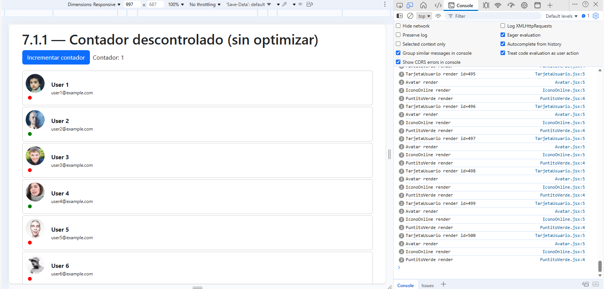
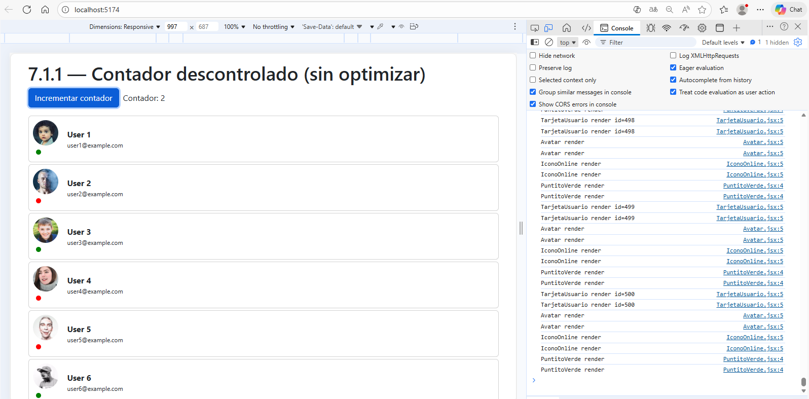
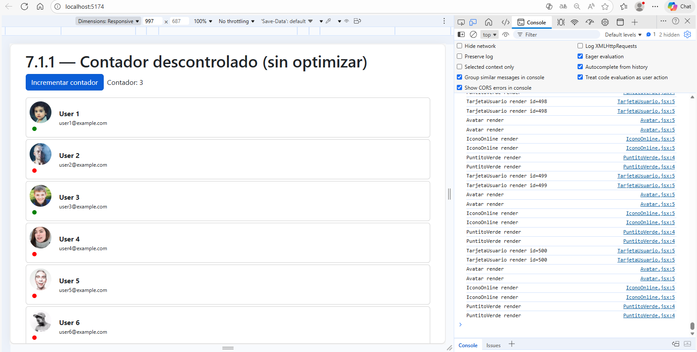
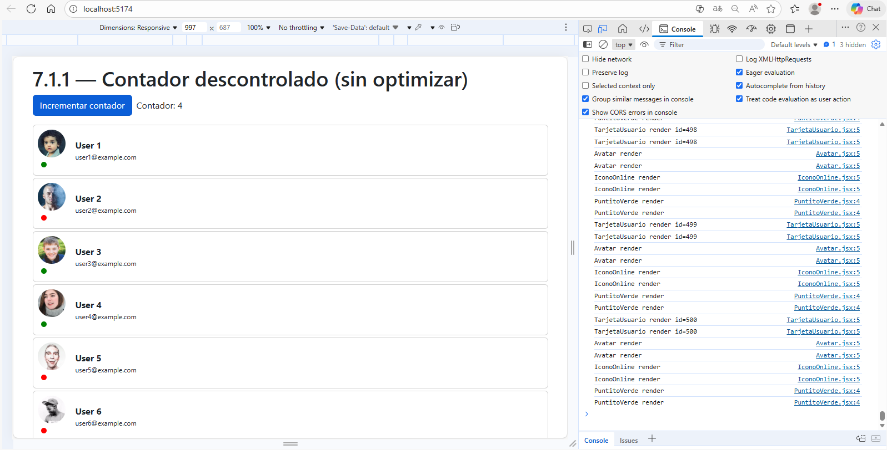
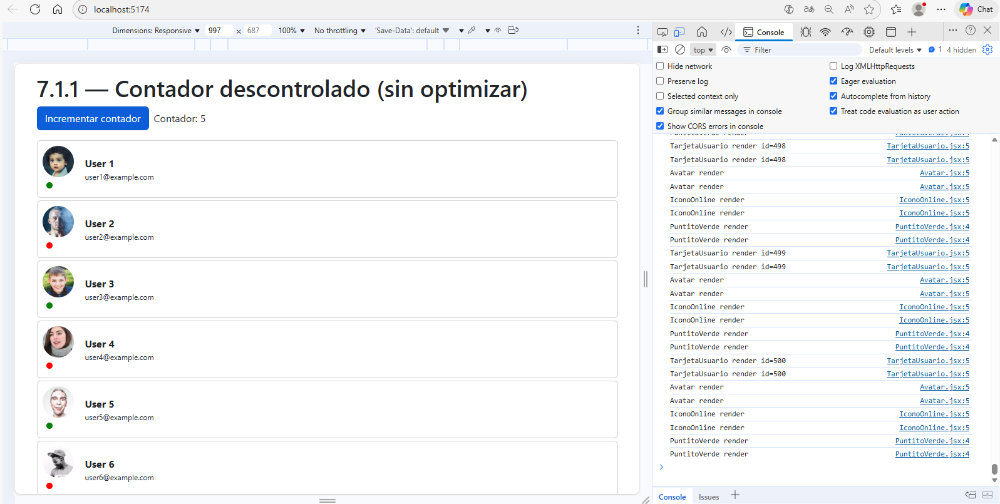

# Ejercicio 7.1.1_opt – Contador Descontrolado Optimizado

## Descripción
Este ejercicio mejora el rendimiento del ejercicio 7.1.1 donde 500 usuarios eran renderizados en 6 niveles de componentes. Antes, cada clic en el contador provocaba renders innecesarios en toda la lista de usuarios.

## Mejoras aplicadas
- Se utilizó **React.memo** en todos los componentes que no dependen del estado del contador (`ListaIntermedia`, `TarjetaUsuario`, `Avatar`, `IconoOnline`, `PuntitoVerde`) para evitar renders innecesarios.
- Se utilizó **useMemo** para generar la lista de 500 usuarios solo una vez al montar el componente.

## Resultado
- Solo se renderizan los componentes que realmente cambian al hacer clic en el contador.
- Mejora notable de rendimiento, la UI no se congela al interactuar con el contador.

## Capturas del Profiler

