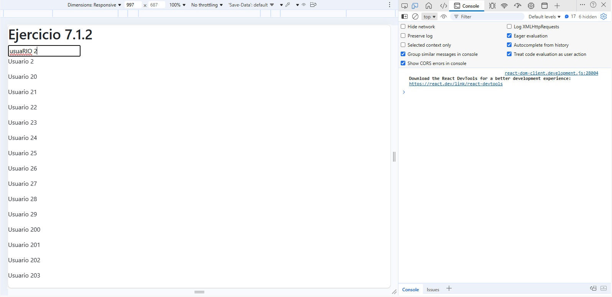

# Ejercicio 7.1.2 – Filtro de 10.000 usuarios con useMemo

## Descripción
Aplicación que lista 10.000 usuarios y permite filtrarlos con un input de búsqueda. Inicialmente, cada cambio en el input provocaba renders de todos los usuarios, haciendo la app muy lenta.

## Mejoras aplicadas
- Se utilizó **useMemo** para memorizar la lista filtrada de usuarios según el input de búsqueda, evitando recalcular toda la lista en cada render.
- Se utilizó **React.memo** en `UserCard` y `UserList` para evitar renders de componentes que no cambiaron.

## Resultado
- La búsqueda es instantánea, incluso con 10.000 usuarios.
- Solo se renderizan los usuarios visibles o filtrados, mejorando significativamente el rendimiento.

## Capturas del Profiler

