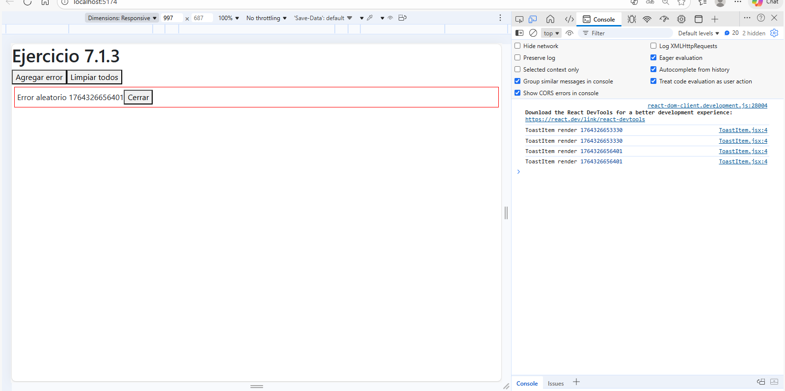

# Ejercicio 7.1.3 – Toasts con funciones inline

## Descripción
Sistema de notificaciones donde cada error se muestra como un toast. Inicialmente, al agregar o limpiar un error, todos los ToastItems se re-renderizaban innecesariamente.

## Mejoras aplicadas
- Se envolvió la función `onClose` con **useCallback** para que su referencia no cambie en cada render.
- Se utilizó **React.memo** en `ToastItem` y `ToastContainer` para evitar renders innecesarios cuando las props no cambian.

## Resultado
- Solo se renderiza el ToastItem afectado (el que se agrega o se elimina).
- La app responde de manera rápida y eficiente, incluso con muchos toasts.

## Capturas del Profiler

